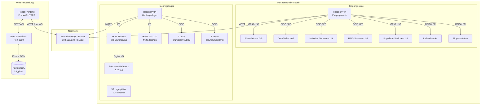
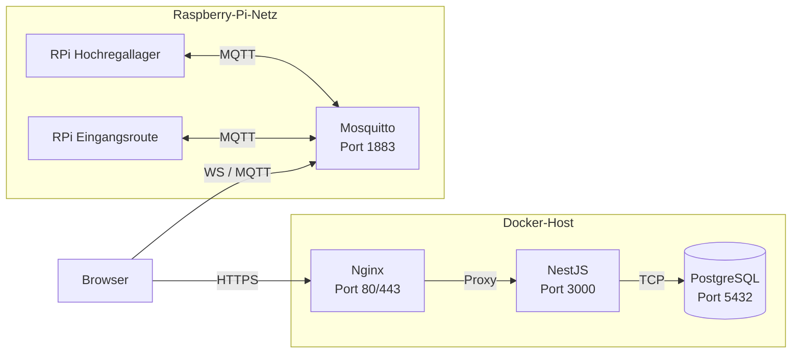

# Architekturübersicht – IoT-Logistikmodell

## 1. Einleitung

Das IoT-Logistikmodell der DHBW Lörrach bildet eine vollständige Intralogistik-Kette
im Miniaturmaßstab ab. Es basiert auf **Fischertechnik**-Bauteilen und wird über
**Raspberry Pi**-Einplatinencomputer gesteuert. Die Kommunikation zwischen den Modulen
sowie mit der Web-Oberfläche erfolgt über das **MQTT**-Protokoll.

Das Gesamtsystem besteht aus zwei physischen Modulen:

| Modul | Beschreibung |
|---|---|
| **Hochregallager** (High-Bay Storage, HBS) | Automatisiertes Regal mit 50 Lagerplätzen (10 × 5), drei Achsen (X, Y, Z) und Pick-and-Place-Mechanik |
| **Eingangsroute** (Entry Route) | Förderstrecke mit Förderbändern, Sensoren, RFID-Lesegeräten und Kugellade-Stationen |

Beide Module werden über einen zentralen MQTT-Broker vernetzt und über ein
React-basiertes Web-Frontend visualisiert und bedient.

---

## 2. Systemkomponenten und ihre Aufgaben

### 2.1 Hardware-Ebene

```
┌──────────────────────────────────────────────────────────────────┐
│  Fischertechnik-Modell                                           │
│                                                                  │
│  ┌───────────────────────┐      ┌──────────────────────────┐    │
│  │  Eingangsroute         │      │  Hochregallager           │    │
│  │  - 5 Förderbänder      │ ───► │  - 3-Achsen-Fahrwerk      │    │
│  │  - 1 Drehförderband    │      │  - 50 Lagerplätze (10×5)  │    │
│  │  - 5 induktive Sensoren│      │  - Greifmechanik          │    │
│  │  - 3 RFID-Sensoren     │      │  - 4 LEDs + 4 Taster      │    │
│  │  - 3 Kugellade-Stat.   │      │  - LCD 4×20 (HD44780)     │    │
│  │  - 1 Lichtschranke     │      │                            │    │
│  │  - 1 Eingabestation    │      │                            │    │
│  └───────────┬───────────┘      └───────────┬──────────────┘    │
│              │ GPIO / I²C                     │ GPIO / I²C        │
│  ┌───────────▼───────────┐      ┌───────────▼──────────────┐    │
│  │  Raspberry Pi          │      │  Raspberry Pi              │    │
│  │  (Eingangsroute)       │      │  (Hochregallager)          │    │
│  └───────────┬───────────┘      └───────────┬──────────────┘    │
│              │ WLAN / Ethernet                │ WLAN / Ethernet   │
└──────────────┼───────────────────────────────┼──────────────────┘
               │                               │
               ▼                               ▼
        ┌──────────────────────────────────────────┐
        │         MQTT-Broker (Mosquitto)           │
        │         IP: 192.168.178.40 : 1883         │
        └──────────────────┬───────────────────────┘
                           │
               ┌───────────▼───────────┐
               │  Web-Frontend (React)  │
               │  mqtt.js über WS       │
               └───────────────────────┘
```

#### Hochregallager – Hardware-Details

| Komponente | Details |
|---|---|
| **Steuerung** | Raspberry Pi (Linux), Python 3 |
| **I/O-Erweiterung** | 3× MCP23017 (I²C, Adressen `0x20`, `0x24`, `0x22`) – 32 Eingänge, 16 Ausgänge |
| **Anzeige** | HD44780-LCD 4×20 Zeichen über PCF8574 (I²C, Adresse `0x27`) |
| **LEDs** | Grün (bereit), Gelb (beschäftigt), Rot (Fehler), Blau (Lager voll) |
| **Taster** | Blau (manueller Modus), Grün (runter), Gelb (hoch), Rot (Not-Aus) |
| **Achsen** | X (Positionen 1–10), Y (DESTORE / DEFAULT / STORE), Z (Ebenen 1–5) |
| **Lagerplätze** | 50 Stück (10 X-Positionen × 5 Z-Ebenen) |
| **Bibliotheken** | `RPLCD`, `RPi.GPIO`, `smbus2` |

#### Eingangsroute – Hardware-Details

| Komponente | Anzahl | Funktion |
|---|---|---|
| **Förderbänder** | 5 | Transport von Werkstücken entlang der Route |
| **Drehförderband** | 1 | Richtungswechsel / Weiche |
| **Induktive Sensoren** | 5 | Erkennung metallischer Werkstücke |
| **RFID-Sensoren** | 3 | Identifikation per RFID-Tag |
| **Kugellade-Stationen** | 3 | Beladung mit Kugeln (pneumatisch) |
| **Lichtschranke** | 1 | Unterbrechungserkennung |
| **Eingabestation** | 1 | Einschleusung neuer Werkstücke |

### 2.2 Software-Ebene

| Schicht | Technologie | Aufgabe |
|---|---|---|
| **Modul-Steuerung** | Python 3 auf Raspberry Pi | Hardwareansteuerung, Zustandsverwaltung, MQTT-Client |
| **MQTT-Broker** | Eclipse Mosquitto | Nachrichtenverteilung zwischen Modulen und Frontend |
| **Backend** | NestJS + Prisma + PostgreSQL | REST-API, Datenpersistenz, Geschäftslogik |
| **Frontend** | React 19 + TypeScript + Vite + MUI 7 | Interaktive Anlagenvisualisierung, MQTT-Einstellungen |
| **Infrastruktur** | Docker Compose, Nginx (HTTPS) | Containerisierung, Reverse Proxy, SSL-Terminierung |

### 2.3 Datenbank

- **DBMS:** PostgreSQL 16 (Alpine)
- **ORM:** Prisma
- **Datenbank-Name:** `iot_plant`
- **Zugangsdaten:** `postgres` / `postgres` (Entwicklungsumgebung)

---

## 3. Kommunikationsfluss (MQTT)

### 3.1 MQTT-Broker

| Parameter | Wert |
|---|---|
| Software | Eclipse Mosquitto |
| IP-Adresse | `192.168.178.40` (Produktionsnetz) / `192.168.1.94` (alternatives Netz im Code) |
| Port | `1883` (TCP) |
| Benutzername | `dhbw-mqtt` |
| Passwort | `daisy56` |
| WebSocket | Über Nginx-Proxy für Frontend verfügbar |

### 3.2 MQTT-Topics

#### Hochregallager

| Topic | Richtung | Beschreibung |
|---|---|---|
| `hochregallager/set` | Frontend/Eingangsroute → HBS | Befehle an das Hochregallager |
| `hochregallager/status` | HBS → Frontend | Aktueller Systemstatus (bereit, beschäftigt, Fehler) |
| `hochregallager/result` | HBS → Frontend | Ergebnis einer abgeschlossenen Operation |

#### Eingangsroute (erwartet)

| Topic | Richtung | Beschreibung |
|---|---|---|
| `eingangsroute/set` | Frontend → Eingangsroute | Befehle an die Eingangsroute |
| `eingangsroute/status` | Eingangsroute → Frontend | Statusmeldungen der Förderstrecke |
| `eingangsroute/sensor/<id>` | Eingangsroute → Frontend | Sensordaten (induktiv, RFID, Lichtschranke) |

> **Hinweis:** Die Topics der Eingangsroute sind hier als erwartete Konvention
> dokumentiert. Die tatsächlichen Topics konnten nicht aus dem Quellcode verifiziert
> werden, da das Repository `DHBWLoerrach/iot-logistikmodel` privat und nicht
> zugänglich ist.

### 3.3 Nachrichtenformat (JSON)

Alle MQTT-Nachrichten verwenden JSON:

```json
{
  "operation": "<OPERATIONS_CODE>",
  "x": <nummer>,
  "z": <nummer>,
  "x_new": <nummer>,
  "z_new": <nummer>
}
```

Nur das Feld `operation` ist immer erforderlich. Die übrigen Felder sind
operationsabhängig (siehe [Hochregallager-Dokumentation](../integration/highbay-storage.md)).

---

## 4. Komponentendiagramm



---

## 5. Deployment-Architektur



**Wichtige Hinweise:**

- Der MQTT-Broker (Mosquitto) ist **nicht** im Docker-Compose enthalten, sondern läuft
  als eigenständiger Dienst auf einem separaten Raspberry Pi oder Server im lokalen
  Netzwerk.
- Das Frontend verbindet sich über WebSockets direkt mit dem MQTT-Broker. Die
  Broker-Adresse wird auf der `/mqtt`-Einstellungsseite konfiguriert.
- HTTP wird automatisch auf HTTPS umgeleitet (selbstsigniertes Zertifikat im
  Entwicklungsbetrieb).

---

## 6. Technologie-Stack (Zusammenfassung)

| Bereich | Technologie | Version / Hinweis |
|---|---|---|
| Modul-Steuerung | Python 3 | Auf Raspberry Pi |
| MQTT-Client (Module) | paho-mqtt | Python-Bibliothek |
| I²C-Kommunikation | smbus2 | MCP23017-Ansteuerung |
| LCD-Ansteuerung | RPLCD | HD44780 über PCF8574 |
| GPIO | RPi.GPIO | Taster und LEDs |
| MQTT-Broker | Mosquitto | Standalone-Dienst |
| Frontend | React 19 + TypeScript | Vite als Build-Tool |
| UI-Framework | Material-UI (MUI) v7 | Komponentenbibliothek |
| MQTT-Client (Frontend) | mqtt.js | WebSocket-Verbindung |
| Backend | NestJS | REST-API |
| ORM | Prisma | Datenbank-Abstraktionsschicht |
| Datenbank | PostgreSQL 16 | Alpine-Image |
| Containerisierung | Docker Compose | Multi-Container-Setup |
| Reverse Proxy | Nginx | SSL-Terminierung |
