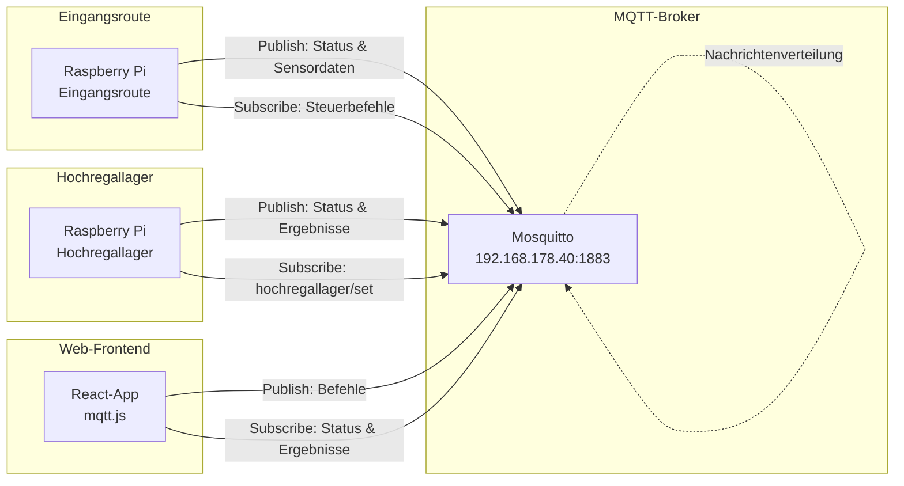
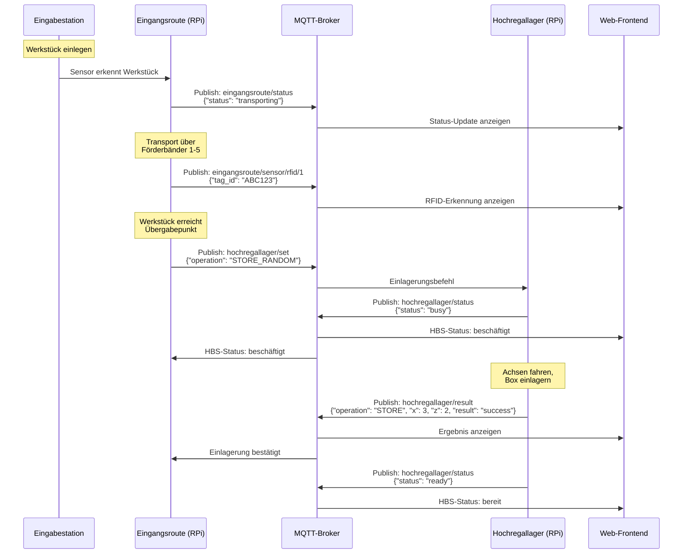
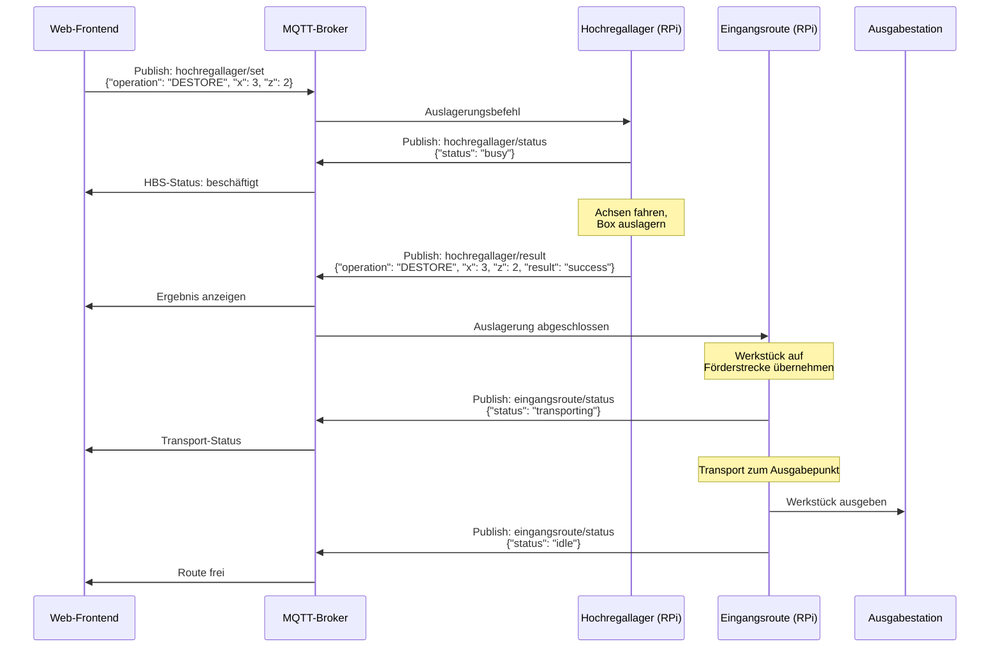
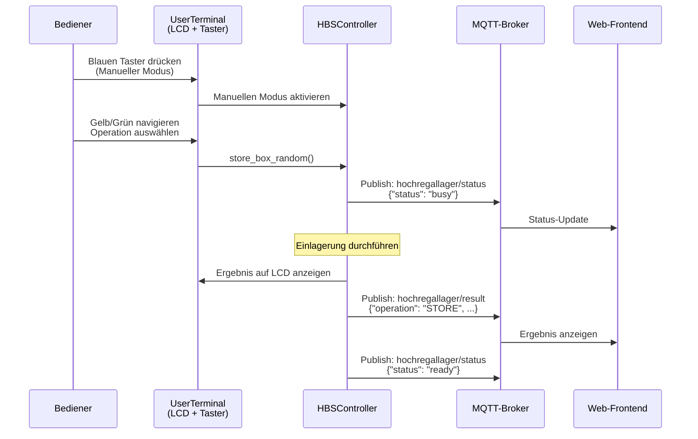
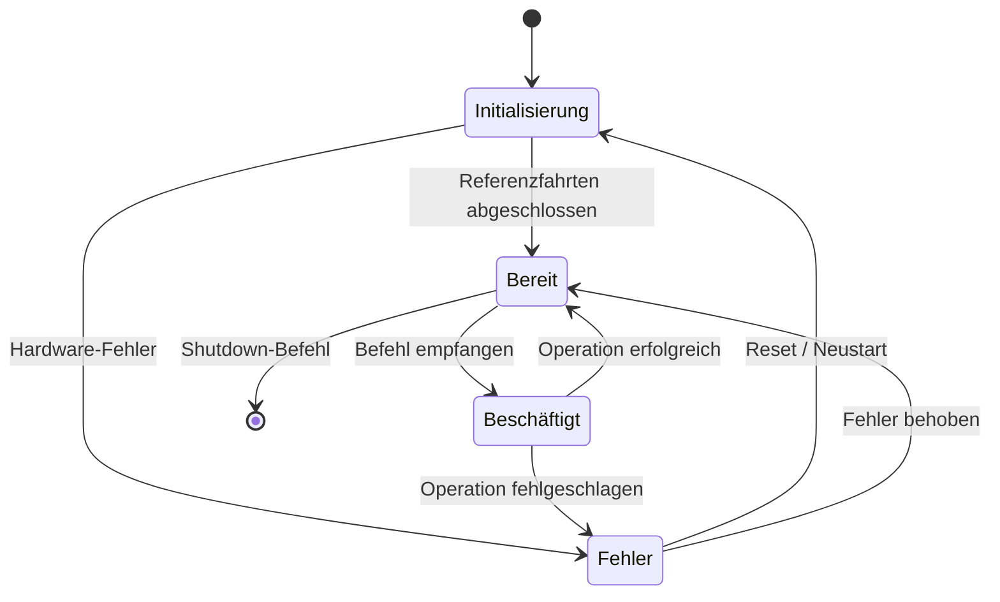

# Modulinteraktion – Hochregallager & Eingangsroute

## 1. Übersicht

Das IoT-Logistikmodell besteht aus zwei physisch getrennten Modulen, die über einen
gemeinsamen **MQTT-Broker** miteinander kommunizieren. Dieses Dokument beschreibt,
wie die Module zusammenspielen, welche Daten ausgetauscht werden und wie der typische
Materialfluss abläuft.

---

## 2. Architektur der Interaktion



### Kommunikationsprinzip

- **Lose Kopplung:** Die Module kennen sich nicht direkt – sie kommunizieren
  ausschließlich über MQTT-Topics.
- **Publish/Subscribe:** Jedes Modul veröffentlicht seinen Status und abonniert
  Befehle.
- **Zentraler Broker:** Mosquitto verteilt alle Nachrichten an die jeweiligen
  Abonnenten.
- **Frontend als Orchestrator:** Das Web-Frontend kann Befehle an beide Module
  senden und deren Status visualisieren.

---

## 3. Gemeinsame MQTT-Infrastruktur

### 3.1 Broker-Konfiguration

| Parameter | Wert |
|---|---|
| **Software** | Eclipse Mosquitto |
| **IP-Adresse** | `192.168.178.40` |
| **TCP-Port** | `1883` |
| **Benutzername** | `dhbw-mqtt` |
| **Passwort** | `daisy56` |
| **Protokoll** | MQTT v3.1.1 / v5.0 |

### 3.2 Topic-Übersicht (Gesamtsystem)

| Topic | Sender | Empfänger | Beschreibung |
|---|---|---|---|
| `hochregallager/set` | Frontend, Eingangsroute | Hochregallager | Steuerbefehle für HBS |
| `hochregallager/status` | Hochregallager | Frontend, Eingangsroute | Systemstatus des HBS |
| `hochregallager/result` | Hochregallager | Frontend, Eingangsroute | Ergebnis einer HBS-Operation |
| `eingangsroute/set`* | Frontend | Eingangsroute | Steuerbefehle für Eingangsroute |
| `eingangsroute/status`* | Eingangsroute | Frontend | Status der Eingangsroute |
| `eingangsroute/sensor/*`* | Eingangsroute | Frontend | Sensordaten |

> \* = Geschätzte Topics – noch nicht aus Quellcode verifiziert (siehe
> [Eingangsroute-Dokumentation](entry-route.md)).

---

## 4. Materialfluss und Interaktionsszenarien

### 4.1 Szenario: Werkstück einlagern (End-to-End)



### 4.2 Szenario: Werkstück auslagern und über Eingangsroute ausgeben



### 4.3 Szenario: Manueller Betrieb am Hochregallager



---

## 5. Datenformate im Austausch

### 5.1 Befehlsnachrichten (→ Modul)

Befehle an ein Modul folgen einem einheitlichen JSON-Schema:

```json
{
  "operation": "<OPERATIONS_CODE>",
  "<param1>": <wert>,
  "<param2>": <wert>
}
```

#### Hochregallager-Befehle (verifiziert)

| Operation | Zusätzliche Felder | Beispiel |
|---|---|---|
| `STORE` | `x`, `z` | `{"operation": "STORE", "x": 5, "z": 3}` |
| `STORE_RANDOM` | – | `{"operation": "STORE_RANDOM"}` |
| `STORE_ASCENDING` | – | `{"operation": "STORE_ASCENDING"}` |
| `DESTORE` | `x`, `z` | `{"operation": "DESTORE", "x": 5, "z": 3}` |
| `DESTORE_RANDOM` | – | `{"operation": "DESTORE_RANDOM"}` |
| `DESTORE_ASCENDING` | – | `{"operation": "DESTORE_ASCENDING"}` |
| `DESTORE_OLDEST` | – | `{"operation": "DESTORE_OLDEST"}` |
| `REARRANGE` | `x`, `z`, `x_new`, `z_new` | `{"operation": "REARRANGE", "x": 2, "z": 1, "x_new": 8, "z_new": 4}` |

### 5.2 Statusnachrichten (Modul →)

```json
{
  "status": "<ready|busy|error>"
}
```

| Wert | Bedeutung | LED am HBS |
|---|---|---|
| `ready` | Modul betriebsbereit | 🟢 Grün |
| `busy` | Operation wird ausgeführt | 🟡 Gelb |
| `error` | Fehler aufgetreten | 🔴 Rot |

### 5.3 Ergebnisnachrichten (Modul →)

```json
{
  "operation": "<OPERATIONS_CODE>",
  "x": <nummer>,
  "z": <nummer>,
  "result": "<success|error>",
  "message": "<Klartext-Fehlermeldung>"
}
```

### 5.4 Sensordaten – Eingangsroute (geschätzt)

#### Induktiver Sensor

```json
{
  "sensor_id": 1,
  "type": "inductive",
  "detected": true,
  "timestamp": "2026-03-16T10:30:00Z"
}
```

#### RFID-Sensor

```json
{
  "sensor_id": 1,
  "type": "rfid",
  "tag_id": "ABC123",
  "timestamp": "2026-03-16T10:30:05Z"
}
```

#### Lichtschranke

```json
{
  "sensor_id": 1,
  "type": "light_barrier",
  "interrupted": true,
  "timestamp": "2026-03-16T10:30:10Z"
}
```

> **⚠️ Hinweis:** Die Sensordaten-Formate der Eingangsroute sind geschätzt und
> noch nicht verifiziert.

---

## 6. Fehlerbehandlung und Zustandsübergänge

### 6.1 Zustandsdiagramm des Hochregallagers



### 6.2 Typische Fehlerfälle

| Fehler | Ursache | MQTT-Meldung | Reaktion |
|---|---|---|---|
| Platz belegt | Einlagerung an belegten Platz | `{"result": "error", "message": "..."}` | Anderen Platz wählen |
| Platz leer | Auslagerung von leerem Platz | `{"result": "error", "message": "..."}` | Belegung prüfen |
| Lager voll | Alle 50 Plätze belegt | `{"result": "error", "message": "..."}` | Blaue LED leuchtet |
| Not-Aus | Roter Taster gedrückt | `{"status": "error"}` | Manueller Reset nötig |
| MQTT-Verbindung unterbrochen | Netzwerkproblem | Keine Meldung möglich | Automatische Wiederverbindung |

---

## 7. Zeitverhalten

### 7.1 Typische Dauern (geschätzt)

| Operation | Geschätzte Dauer | Beschreibung |
|---|---|---|
| Referenzfahrt (pro Achse) | 5–15 s | Achse fährt zum Endschalter |
| Einlagerung (nah) | 10–20 s | Kurzer Achsenweg |
| Einlagerung (fern) | 20–40 s | Maximaler Achsenweg |
| Auslagerung | 10–40 s | Abhängig von Position |
| Umlagern | 20–60 s | Zwei Fahrten erforderlich |
| Förderband-Transport | 5–30 s | Abhängig von Strecke |

### 7.2 Reihenfolge-Garantien

- **MQTT QoS 0/1:** Nachrichten können (selten) verloren gehen oder doppelt ankommen
- **Sequenziell:** Das Hochregallager verarbeitet Befehle **nacheinander** – ein neuer
  Befehl wird erst nach Abschluss des aktuellen akzeptiert (Status: `busy`)
- **Keine Warteschlange:** Befehle, die während `busy` eintreffen, werden
  typischerweise verworfen → Frontend sollte auf `ready` warten
